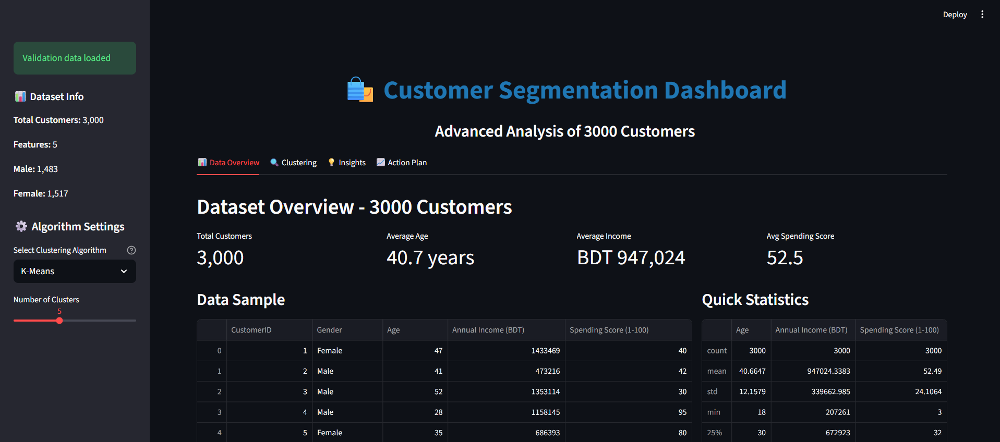

# 🛍️ Customer Segmentation using Clustering Algorithms

Ever wondered how businesses know exactly what their customers want? This project tackles that problem using machine learning.

I built a complete customer segmentation system that analyzes shopping behavior and automatically groups customers into meaningful segments. Think of it as giving businesses "customer X-ray vision" - they can see patterns that aren't obvious at first glance.

**Built as my final year BSc project in Computer Science & Engineering**

---

## What Does This Actually Do?

Imagine you're running a shopping mall with 3,000 customers. Some are young high-spenders who love premium brands. Others are budget-conscious families looking for deals. Without data, you'd treat everyone the same way - wasting money on marketing that doesn't work.

This system solves that problem by:

- Automatically finding distinct customer groups based on their behavior
- Telling you exactly who these customers are (age, income, spending habits)
- Suggesting specific marketing strategies for each group

No more one-size-fits-all marketing - just segments backed by real patterns in the data. (A couple of the specific product ideas later in this README are still my own suggestions, not something the algorithm invented - more on that where they show up.)

---

## The Results (TL;DR)

- **Analyzed**: 3,000 mall customers
- **Tested**: 4 different machine learning algorithms
- **Found**: 5 distinct customer segments
- **Validation score**: 96.89% ARI against the synthetic ground truth (see caveat below)
- **Best Algorithm**: K-Means (though I tested GMM, Hierarchical, and DBSCAN too)

> Quick honesty check on that 96.89%: the "true answer" I'm comparing against comes from my own data generator, and I built it using five very cleanly separated groups (there's a note about this in `generator.py` itself). So this number mostly proves the clustering code can correctly re-discover groups I already made obvious - it isn't proof that messier, real-world purchase data would cluster this cleanly. Think of it as "the pipeline works" more than "this is the accuracy you'd get on your own data."

The system identified groups like "Young Affluent Spenders" and "Senior Budget-Conscious Shoppers" - each needing completely different marketing approaches.

---

## Live Demo

Here's what the interactive dashboard looks like in action:



_The dashboard lets you switch between algorithms, see clusters in 3D, and get instant business insights - no coding required._

---

## Why I Built This

During my studies, I noticed a gap: most academic projects use tiny datasets (500-800 customers) and stop at technical results. I wanted to build something that:

1. **Actually scales** - 3,000 customers is realistic for mid-sized businesses
2. **Compares properly** - testing 4 algorithms to see what really works best
3. **Provides real value** - not just clustering scores, but actual marketing strategies
4. **Anyone can use** - built a dashboard so non-technical people can explore the data

Basically, I wanted to bridge the gap between "cool ML project" and "something a business could actually deploy tomorrow."

---

## The Customer Segments We Discovered

After running the analysis, here's what emerged. Quick note before you read these: the "what they want" and "strategy" lines are my own reasoning based on each group's age/income/spending profile - the dataset itself only has those three numbers, no actual purchase history. So treat the segments (and the numbers behind them) as real; treat the marketing ideas as a sensible starting point for a marketer to build on, not a data-proven fact.

### 1. Young Affluent Spenders (20% of customers)

- **Profile**: Average age 25, income BDT 1.2M, very high spending (85/100)
- **What they want**: Premium products, exclusive experiences
- **Strategy**: VIP programs, early access to new products, luxury branding

### 2. Middle-Income Families (22%)

- **Profile**: Age 41, income BDT 513K, moderate spending (47/100)
- **What they want**: Value for money, family-friendly options
- **Strategy**: Bundle deals, seasonal sales, family packages

### 3. High-Income Conservatives (20%)

- **Profile**: Age 49, income BDT 1.4M, surprisingly low spending (35/100)
- **What they want**: Trust, quality assurance, value demonstration
- **Strategy**: This is the "untapped potential" group - focus on building trust

### 4. Senior Budget-Conscious (18%)

- **Profile**: Age 57, income BDT 891K, minimal spending (22/100)
- **What they want**: Affordability, simplicity, discounts
- **Strategy**: Senior discounts, straightforward messaging, value products

### 5. Value-Seeking Shoppers (21%)

- **Profile**: Age 31, income BDT 749K, high engagement (72/100)
- **What they want**: Quality at reasonable prices
- **Strategy**: Loyalty programs, quality emphasis, exclusive member benefits

---

## How It Works (The Technical Bit)

### The Algorithms I Compared

I didn't just use one algorithm and call it done. I tested four different approaches:

**K-Means** (Winner - 0.549 Silhouette Score)

- Fastest, most reliable
- Works great when customer groups are relatively distinct
- Industry standard for a reason

**Gaussian Mixture Models** (Close second - 0.549)

- Almost identical performance to K-Means
- Gives probability scores ("this customer is 80% likely Segment A")
- Useful when customers fit multiple segments

**Hierarchical Clustering** (Solid - 0.546)

- Creates a family tree of customer relationships
- Great for understanding how segments relate to each other
- Slightly slower but very interpretable

**DBSCAN** (Works, but not the winner here - 0.465)

- My first attempt gave DBSCAN one "best guess" for its settings (it needs to know how close points must be to count as the same group), and that guess lumped every single customer into one giant cluster
- Instead of trusting that one guess, the script now quietly tries a handful of nearby settings and keeps whichever works best. With better settings, DBSCAN does find all 5 real segments (Silhouette 0.465, and it marks about 11% of customers as "noise" - outliers that don't cleanly belong anywhere)
- It still doesn't beat K-Means or GMM on this particular data, but the earlier "DBSCAN just doesn't work here" conclusion wasn't quite fair - it needed a proper search, not one lucky guess

### Validation: How I Know It Actually Works

I didn't just trust the algorithms blindly. I validated results four ways:

1. **Silhouette Score** (0.549) - are customers in the same group actually similar to each other, and clearly different from people in other groups? It runs from -1 to 1, and anything above 0.5 is considered solid for real-world-ish data.
2. **Davies-Bouldin Index** (0.651) - a second, independent quality check (lower is better here, unlike Silhouette). It agreed with the Silhouette score, which is reassuring since it's a completely different formula reaching the same conclusion.
3. **Calinski-Harabasz** (6,504) - a third check, comparing how spread apart the clusters are versus how tight each one is internally (higher is better). Again, it agreed with the other two.
4. **Ground Truth Comparison** (96.89% ARI) - since I built the test data myself, I know which "real" group each customer was supposed to end up in. This checks how often the algorithm's answer matched mine (see the caveat above about what that does and doesn't prove).

All four metrics agreed: K-Means found real, meaningful patterns in this data.

---

## Quick Start

Want to run this yourself? Here's how:

### Installation

```bash
# Clone the repo
git clone https://github.com/shadinbyte/customer-segmentation-clustering.git
cd customer-segmentation-clustering

# Install requirements
pip install -r requirements.txt
```

### Generate Sample Data

```bash
python generator.py
```

Note: this needs Python 3.12+. The pinned dependencies (numpy 2.5.3, scipy 1.18.1) require it - see "Technologies Used" below.

This creates realistic synthetic customer data. I used synthetic data for privacy reasons - no real customer information here.

### Run the Analysis

```bash
python customer_segmentation_analysis.py
```

Sit back for 2-3 minutes. The script will:

- Run all 4 algorithms
- Generate 9 visualization charts
- Calculate all quality metrics
- Create segment profiles with business recommendations
- Save everything to `clustering_results_3000/`

### Launch the Dashboard

```bash
streamlit run customer_segmentation_dashboard.py
```

Opens in your browser at `http://localhost:8501`

Now you can:

- Switch between algorithms live
- Adjust parameters and see instant results
- Rotate 3D visualizations
- Export results as CSV
- Show it to your non-technical boss!

---

## Project Structure

```
customer-segmentation-clustering/
├── customer_segmentation_analysis.py   # Main analysis engine
├── customer_segmentation_dashboard.py  # Interactive dashboard
├── generator.py                        # Creates realistic test data
├── business_rules.py                   # Shared segment logic (age/income/spending rules, marketing text) - used by both the analysis engine and the dashboard so they can't drift apart
├── requirements.txt                    # Python dependencies
├── clustering_results_3000/            # All outputs go here
│   ├── *.png                          # Visualizations
│   └── *.csv                          # Results & metrics
└── README.md                           # You are here!
```

Everything is self-contained. No complex setup, no database required.

---

## What I Learned Building This

**Technical Skills:**

- How different ML algorithms actually behave with real-ish data
- Why feature scaling matters so much (spoiler: distance calculations)
- The importance of using multiple validation metrics
- Building dashboards that non-coders can actually use

**Practical Insights:**

- DBSCAN needs real parameter tuning before you can fairly judge it - my first "best guess" made it look broken when it wasn't
- K-Means++ initialization is way better than random (faster convergence)
- Silhouette scores alone don't tell the full story
- Business interpretability matters as much as technical accuracy

**What I'd Do Differently:**

- Add temporal analysis (how do customers move between segments over time?)
- Integrate with a real CRM system instead of CSV files
- Build a REST API so marketing tools could query segments automatically
- Add A/B testing framework to measure if segmentation actually improves campaigns

---

## Technologies Used

**Core:**

- Python 3.12+ (numpy and scipy both bumped their minimum version requirement recently, which drags this up)
- Scikit-learn (the ML heavy lifting)
- Pandas & NumPy (data wrangling)

**Visualization:**

- Matplotlib & Seaborn (static charts)
- Plotly (interactive 3D plots)

**Dashboard:**

- Streamlit (turns Python into a web app)

**Development:**

- Git/GitHub (version control)
- Jupyter Notebooks (experimentation)

---

## Files You'll Get After Running

The analysis generates everything you need:

**Visualizations** (all 300 DPI, publication-ready)

- Exploratory data analysis charts
- Correlation heatmaps
- Optimal K determination plots
- Cluster visualizations (one per algorithm)
- Algorithm comparison charts
- Dendrogram (hierarchical relationships)

**Data Files**

- Complete results with cluster assignments
- Algorithm performance comparison
- Detailed metrics for each algorithm

**Business Intelligence**

- Segment profiles with demographics
- Marketing strategy recommendations
- Customer counts and distributions

---

## Results at a Glance

| Algorithm        | Silhouette Score | Davies-Bouldin | Calinski-Harabasz | Segments Found |
| ---------------- | ----------------- | -------------- | ------------------ | --------------- |
| **K-Means**      | **0.549**          | 0.651          | 6,504               | 5               |
| Gaussian Mixture | 0.549              | 0.651          | 6,496               | 5               |
| Hierarchical     | 0.546              | 0.655          | 6,438               | 5               |
| DBSCAN           | 0.465              | 1.495          | 2,578               | 5\*             |

\*DBSCAN also leaves about 11% of customers unassigned as "noise" (points that didn't cleanly fit any group) - the other three algorithms place every single customer into a segment.

**Key Finding**: K-Means, GMM, and Hierarchical all landed on nearly the same answer, which is a good sign - three different mathematical approaches agreeing means the 5 segments are probably real, not an artifact of one algorithm's quirks. DBSCAN gets there too once it's tuned properly, just with a bit more noise and lower separation scores. For clean, roughly round customer groups like these, the "classic" algorithms win; DBSCAN's real strength is oddly-shaped clusters, which isn't really what this dataset has.

---

## Real-World Applications

This isn't just an academic exercise. Here's how businesses could use this:

**Retail:**

- Personalized email campaigns per segment
- Store layout optimization (premium section vs budget section)
- Inventory planning (stock what each segment wants)

**E-commerce:**

- Product recommendation engines
- Dynamic pricing strategies
- Targeted ads on social media

**Services:**

- Tiered service offerings
- Customized loyalty programs
- Resource allocation (focus sales team on high-value segments)

**General:**

- Customer lifetime value prediction
- Churn risk identification
- New market entry strategies

---

## Why This Matters for Hiring

If you're a hiring manager looking at this, here's what this project demonstrates:

✅ **I can handle real-scale data** - 3,000 records isn't trivial
✅ **I don't just accept defaults** - compared 4 algorithms systematically
✅ **I validate properly** - used multiple metrics, not just one
✅ **I think about end users** - built a dashboard, not just scripts
✅ **I understand business context** - translated clusters into strategies
✅ **I document clearly** - you're reading this, aren't you?
✅ **I don't stop at the first result** - when DBSCAN looked broken, I went back and gave it a proper parameter search before writing it off

I'm not just a coder. I solve problems end-to-end.

---

## Future Enhancements (The Roadmap)

If I had more time, here's what I'd add:

**Short-term:**

- [ ] CSV upload feature (analyze your own data)
- [ ] PDF report generation
- [ ] Email alerts for segment changes

**Medium-term:**

- [ ] REST API for programmatic access
- [ ] Integration with Google Analytics
- [ ] Automated A/B testing framework

**Long-term:**

- [ ] Real-time clustering as new customers arrive
- [ ] Deep learning approaches (autoencoders)
- [ ] Predictive segment migration (who's likely to move to premium?)

---

## Questions?

**Q: Can I use my own data?**
A: Yes! Just format it as CSV with Age, Income, and Spending Score columns. The code handles the rest.

**Q: Why only 3 features?**
A: Simplicity and visualization. The framework easily extends to more features.

**Q: Why synthetic data?**
A: Privacy and reproducibility. Anyone can run this. Real customer data would require NDAs.

**Q: Which algorithm should I actually use?**
A: For customer segmentation like this? K-Means. It's fast, reliable, and interpretable.

**Q: Can this scale to 100,000 customers?**
A: K-Means yes. Hierarchical no (too slow). DBSCAN maybe. GMM probably.

---

## License

MIT License - use it however you want. Build something cool and tell me about it!

---

## Acknowledgments

Thanks to my thesis supervisor for guidance throughout this project.

Inspired by real-world customer analytics challenges in Bangladesh's growing retail sector.

---

**⭐ If this helped you understand customer segmentation or you learned something, drop a star!**
